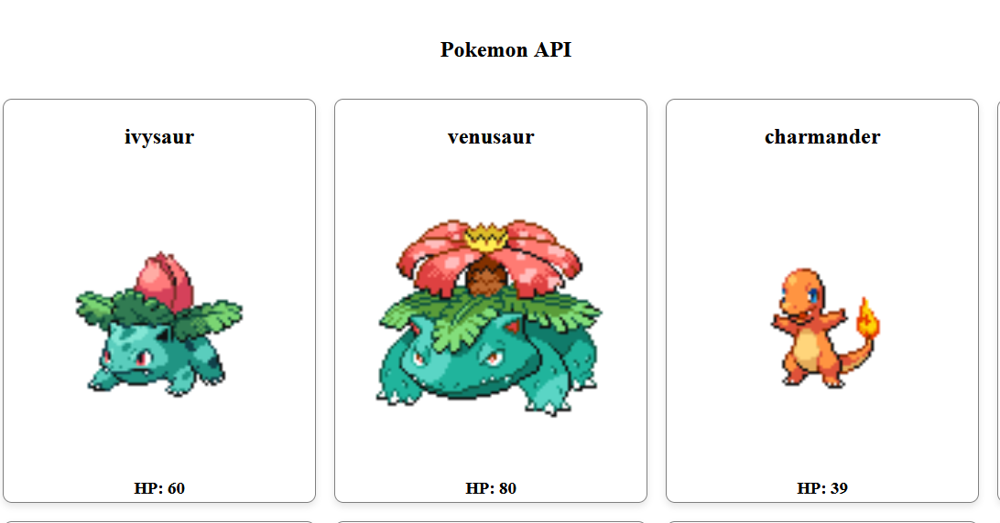

# API POKEMON REACT JS

El siguiente proyecto lleva a cabo la petición y consumo de la API de Pokemon Open Source mediante la librería de JavaScript React JS.



El proyecto destaca por su simpleza ya que solo esta compuesto por dos componentes de React.

Se ha realizado este proyecto siguiendo el curso de Open Webinars "Fundamentos en React".

## Guía de instalación

Para poder visualizar la web lo unico que debemos de tener es un navegador web ya que React es una librería de JavaScript que se ejecuta en el lado del cliente.

Si lo que queremos es modificar el proyecto y evolucinarlo en cuanto a funcionalidad los requisitos que debe de cumplir nuestro equipo son:

    - vite instalado.
    - npm (11.10.1 o superior).
    - node (25.7.0 o superior).

### Pasos a seguir

Si ya tenemos instalados todos los requisitos en cuanto a la modificación de proyecto , lo unico que debemos hacer es:

    1. Abrir la carpeta del proyecto con un IDE o Editor de Texto.
    2. Abrir la Terminal.
    3. Ejecutar el siguiente comando (npm install).
    4. Esto instalar las dependencias del proyecto.
    5. Para ver nuestro proyecto en local (npm run dev).

Una vez ejecutados todos los pasos con exito ya tendriamos lista nuestra aplicación para poder modificarla.

## Estructura de directorios

El proyecto sigue el estandar de directorios de una aplicación React en JavaScript

    - /public: Archivos publicos.
    - /src: Directorio principal del proyecto.
        - /components: Se encuentran los dos componentes de la aplicación.
        - /assets: Se encuentran los assets que no son públicos.
        - App.jsx: Componente padre de los demas componentes.
        - Main.jsx: Es el root del proyecto padre de App.jsx.
        - Main.css :Estilos del Main.jsx
        - App.css: Estilos del App.jsx
    - index.html : Index de la aplicación web.

## REFERENCIA A LA API

En cuanto a la api utilizada en este proyecto se proporciona la url aqui abajo para que los demas desarrolladores puedan realizar evoluciones en la aplicación en un futuro si lo ven conveniente:

```bash
https://pokeapi.co/api/v2/pokemon/
```

Toda la aplicación web en el momento de la primera release esta utilizando esta API.

#### Get all items

```http
  GET https://pokeapi.co/api/v2/pokemon/
```

| Parameter | Type     | Description                |
| :-------- | :------- | :------------------------- |
| `api_key` | `string` | **Null**. Open Source no existe API KEY |

#### Get item

```http
  GET /api/items/${id}
```

| Parameter | Type     | Description                       |
| :-------- | :------- | :-------------------------------- |
| `id`      | `string` | **Opcional**. Id el pokemon para hacer fetch |

## Author

- [@alejandrohuerga](https://github.com/alejandrohuerga)

